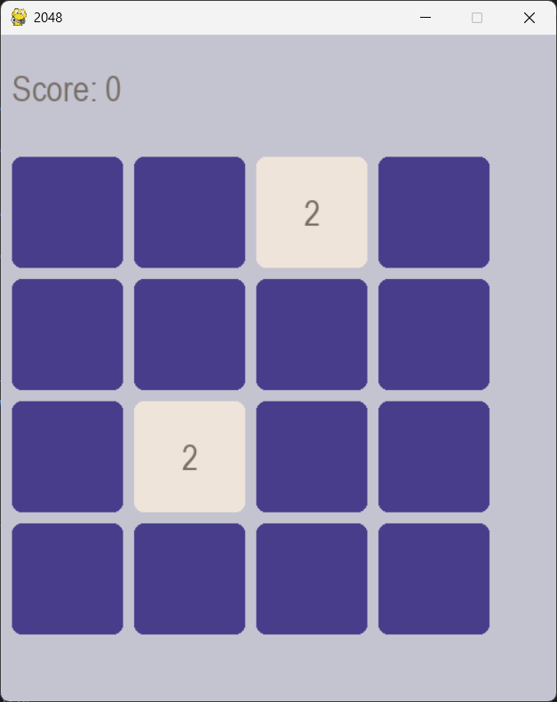

# How to run 2048 Game

## Import files from git

```bash
cd Path/To/Your/Folder
git init
git clone https://github.com/githubmako/2048GamePy
```
## Install required python libraries

```bash 
pip install pygame
```

## Compile:

```bash
cd Path/To/Your/Folder
python main.py

```

<p align="center">
  
</p>

